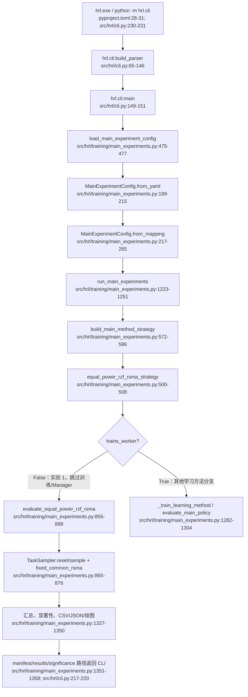
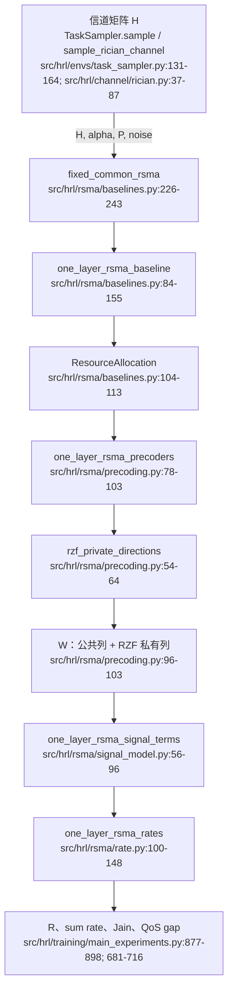

# 实验 1：`equal_power_rzf_rsma` 的整个代码流程

本文只解释五组主实验中的传统物理基线 `equal_power_rzf_rsma`。所有代码引用均指向当前项目中的真实文件和行号；输出目录示例来自已实测的 `outputs/exp1_only/`。

## 第 1 章：实验 1 是什么

本章说明实验 1 的定位、比较对象和科学问题。

`equal_power_rzf_rsma` 是五组主实验中的物理极限/无学习基线：对所有用户固定采用一个公共功率比例 `alpha`，私有流均分剩余功率，并使用 RZF（Regularized Zero-Forcing，正则化迫零）私有预编码；它不使用 Manager、Worker 或 PPO。策略工厂在 `src/hrl/training/main_experiments.py:500-508` 将 `worker_manager` 设为 `None`，并将 `trains_worker`、`trains_manager` 都设为 `False`。

它与另外四组方法的本质差异是：另外四组至少有 PPO Worker，主方法还训练 PPO Manager；实验 1 直接对 held-out 信道场景调用确定性的 RSMA 物理计算，不产生模型参数，也不需要训练或 checkpoint。Runner 在 `src/hrl/training/main_experiments.py:1281-1306` 根据 `trains_worker` 分支，实验 1 直接进入 `evaluate_equal_power_rzf_rsma`。

它回答的科学问题是：在相同混合近场/远场 Rician 信道任务、总功率、噪声和测试场景下，固定 Equal Power + RZF-RSMA 能达到怎样的和速率、最低用户速率、公平性与 QoS 水平。该基线不是学习算法的训练上限，而是固定物理策略的可重复参照。

## 第 2 章：如何运行实验 1

本章给出最小命令、参数含义和命令行输出。

### 2.1 最小 PowerShell 命令

使用 Conda 环境中的入口程序：

```powershell
& 'D:\Anaconda\python11\Scripts\hrl.exe' run-main-experiments `
  --config configs\experiments\main_mixed_near_far.yaml `
  --methods equal_power_rzf_rsma `
  --seeds 11 `
  --output-directory outputs\exp1_only
```

等价的模块写法：

```powershell
& 'D:\Anaconda\python11\python.exe' -m hrl.cli run-main-experiments `
  --config configs\experiments\main_mixed_near_far.yaml `
  --methods equal_power_rzf_rsma `
  --seeds 11 `
  --output-directory outputs\exp1_only
```

`hrl` 控制台脚本由 `pyproject.toml:28-31` 注册为 `hrl.cli:main`。模块入口 `src/hrl/cli.py:230-231` 同样调用 `main()`。项目没有 `src/hrl/__main__.py`，因此 `python -m hrl` 会报 `No module named hrl.__main__; 'hrl' is a package and cannot be directly executed`；应使用 `python -m hrl.cli`。

### 2.2 参数含义

| 参数 | 作用 | 代码依据 |
|---|---|---|
| `--config` | 指定唯一 YAML 实验契约。默认值也是 `configs/experiments/main_mixed_near_far.yaml`。 | `src/hrl/cli.py:125-129` |
| `--methods` | 逗号分隔的方法子集。实验 1 只写 `equal_power_rzf_rsma`。 | `src/hrl/cli.py:131-135` |
| `--seeds` | 覆盖配置中的 training seeds。实验 1 不训练，因此不改变信道物理结果；它会改变输出中 `training_seed` 的记录行数。held-out 场景仍来自 YAML 的 `test` seeds。 | `src/hrl/cli.py:136-140`；`src/hrl/training/main_experiments.py:1239-1250` |
| `--output-directory` | 覆盖 YAML 中的输出目录。 | `src/hrl/cli.py:141-145`；`src/hrl/training/main_experiments.py:1246-1251` |

不需要为了实验 1 单独裁剪 YAML；只用 `--methods equal_power_rzf_rsma` 即可。若只跑一个训练 seed，使用 `--seeds 11`。必须注意：实验 1 的物理指标由 YAML 的 `test`/`test_seeds` 决定，当前配置为 16 个 held-out seeds，见 `configs/experiments/main_mixed_near_far.yaml:13-17`；`--seeds 11` 只作为结果记录中的训练 seed 标签，并不参与 `evaluate_equal_power_rzf_rsma` 的场景循环。

### 2.3 预期 stdout

`src/hrl/cli.py:207-220` 最终依次打印四个路径：

```text
outputs\exp1_only\manifest.json
outputs\exp1_only\results.json
outputs\exp1_only\summary\results.csv
outputs\exp1_only\summary\significance.json
```

实际路径分隔符可能随 Windows `Path` 的字符串表示显示为反斜杠。

## 第 3 章：完整调用链

本章用流程图和节点表把命令、配置、策略分支、物理计算和汇总写盘串起来。

### 3.1 宏观调用链



图中最关键的决策点是 `trains_worker=False`：实验 1 不进入 PPO 训练或 `evaluate_main_policy`，而是对每一个 `test_seed` 重新采样一个场景并直接计算固定 RSMA 结果。汇总阶段仍与五组实验共用同一套指标、bootstrap 汇总、CSV/JSON 和绘图代码。

### 3.2 宏观节点表

| 节点 | 文件:行号 | 输入 | 输出 | 功能说明 |
|---|---|---|---|---|
| CLI 解析 | `src/hrl/cli.py:65-146` | argv | `arguments` | 注册 `run-main-experiments` 及四个参数。 |
| CLI 分发 | `src/hrl/cli.py:149-220` | `arguments` | 四个输出路径 | 读取配置、调用 Runner、打印路径。 |
| 配置加载 | `src/hrl/training/main_experiments.py:475-477` | YAML 路径 | `MainExperimentConfig` | 委托 `from_yaml`。 |
| YAML 解析 | `src/hrl/training/main_experiments.py:199-215` | YAML 文件 | mapping | `safe_load` 并转入 `from_mapping`。 |
| 配置构造 | `src/hrl/training/main_experiments.py:217-265` | YAML mapping | 强类型配置 | 解析 seeds、环境、baseline alpha、分析参数。 |
| Runner | `src/hrl/training/main_experiments.py:1223-1251` | config、方法、seed、输出目录 | 有效配置和输出根目录 | 固定本次运行契约。 |
| 策略选择 | `src/hrl/training/main_experiments.py:572-586` | 方法名 | `MainMethodStrategy` | 映射到五个显式工厂。 |
| 实验 1 策略 | `src/hrl/training/main_experiments.py:500-508` | config、seed | 无学习策略 | Manager/Worker 均为空或不训练。 |
| 分支 | `src/hrl/training/main_experiments.py:1281-1306` | `trains_worker` | 训练或物理评估 | False 时直接调用实验 1 评估器。 |
| 物理评估 | `src/hrl/training/main_experiments.py:855-898` | config | metrics、episode records | 循环 held-out test seeds，累计 16 个时隙指标。 |
| 信道任务 | `src/hrl/envs/task_sampler.py:124-164` | test seed | `RSMAScenario` | 固定 Generator，采样几何、近远场分类和 Rician H。 |
| RSMA 基线 | `src/hrl/rsma/baselines.py:226-243` | H、P、噪声、alpha | `OneLayerRSMABaseline` | 包装单层固定公共功率 RSMA。 |
| RSMA 核心 | `src/hrl/rsma/baselines.py:84-155` | H、资源分配参数 | 预编码、信号项、速率 | 均分私有功率，计算 RZF 速率。 |
| 汇总 | `src/hrl/training/main_experiments.py:1327-1343` | run records | CSV、JSON、显著性、图 | 汇总、写盘和生成图。 |
| 完成 manifest | `src/hrl/training/main_experiments.py:1344-1358` | 输出路径 | `MainExperimentResult` | 记录完成状态、图和四个主路径。 |

### 3.3 物理计算子图



这张图表示数据流而不是训练流：采样得到的 `H` 先确定固定功率资源，再生成公共波束和 RZF 私有波束；信号项转成公共/私有 SINR 和速率，最后由评估器按 episode 长度累计并计算指标。没有策略动作，也没有 `service_mask` 投影。

## 第 4 章：逐层详解

本章按实际调用顺序解释每一层的输入、关键步骤、输出和物理意义。

### 4.1 CLI 层：`build_parser` 与 `main`

- **位置**：`src/hrl/cli.py:65-146`、`src/hrl/cli.py:149-227`。
- **签名**：`build_parser() -> argparse.ArgumentParser`；`main(argv: Sequence[str] | None = None) -> int`。
- **输入**：命令行字符串。`build_parser` 注册 `run-main-experiments`，`main` 解析 `--config`、`--methods`、`--seeds`、`--output-directory`。
- **关键步骤**：
  1. `build_parser` 将 `--methods` 和 `--seeds` 分别解析为字符串元组和整数元组（`src/hrl/cli.py:131-140`）。
  2. `main` 在 `run-main-experiments` 分支先调用配置加载，再调用 Runner（`src/hrl/cli.py:207-216`）。
  3. 按 manifest、根结果 JSON、CSV、显著性 JSON 的顺序打印路径（`src/hrl/cli.py:217-220`）。
- **输出**：返回整数 `0`；路径通过 stdout 输出。

### 4.2 Config 层：`load_main_experiment_config`、`from_yaml`、`from_mapping`

- **位置**：`load_main_experiment_config` 在 `src/hrl/training/main_experiments.py:475-477`；`from_yaml` 在 `:199-215`；`from_mapping` 在 `:217-265`。
- **签名**：`load_main_experiment_config(path: str | Path) -> MainExperimentConfig`；`MainExperimentConfig.from_yaml(path)`；`MainExperimentConfig.from_mapping(payload, source_config=None)`。
- **输入含义**：YAML 路径；mapping 含 `methods`、`seeds`、`environment`、`baseline`、`training`、`analysis`。
- **关键步骤**：
  1. `from_yaml` 检查文件、调用 `yaml.safe_load`，确保根节点是 mapping（`src/hrl/training/main_experiments.py:202-215`）。
  2. `from_mapping` 解析 `seeds.training`、`seeds.test`，环境映射，以及 `baseline.common_power_fraction`（`src/hrl/training/main_experiments.py:229-263`）。
  3. `MainExperimentConfig.__post_init__` 验证方法名、seed、alpha 范围和混合近远场约束（`src/hrl/training/main_experiments.py:146-197`）。
- **输出**：不可变的 `MainExperimentConfig`。`to_dict` 会把配置转换成 JSON/YAML 安全结构，写入快照和 manifest（`src/hrl/training/main_experiments.py:267-320`）。
- **当前物理参数**：6 用户、128 阵元、28 GHz、总功率 1、噪声方差 1、episode 16 时隙、RZF、alpha=0.2，分别见 `configs/experiments/main_mixed_near_far.yaml:19-46`。

### 4.3 Runner 层：`run_main_experiments`

- **位置**：`src/hrl/training/main_experiments.py:1223-1358`。
- **签名**：`run_main_experiments(config, *, methods=None, seeds=None, output_directory=None) -> MainExperimentResult`。
- **关键步骤**：
  1. 若传入路径则加载配置；CLI 的方法和 seed 覆盖配置，但 test seeds 不被覆盖（`src/hrl/training/main_experiments.py:1236-1251`）。
  2. 建立根目录、`summary/`、配置快照和初始 manifest，并把 held-out 场景写入 manifest（`src/hrl/training/main_experiments.py:1252-1270`）。
  3. 对方法和 training seed 循环，构造策略并写 `training_config.json`（`src/hrl/training/main_experiments.py:1271-1280`）。
  4. 实验 1 的 `trains_worker=False`，所以跳过 `_train_learning_method` 和 `evaluate_main_policy`，直接调用 `evaluate_equal_power_rzf_rsma`（`src/hrl/training/main_experiments.py:1281-1306`）。
  5. 写每个 seed 的 evaluation，随后汇总、显著性、CSV、JSON 和图（`src/hrl/training/main_experiments.py:1307-1343`）。
  6. 更新 manifest 为 `completed` 并返回 `MainExperimentResult`（`src/hrl/training/main_experiments.py:1344-1358`）。
- **输出**：每个方法/seed 的 evaluation payload 和最终汇总路径。

### 4.4 策略工厂层

- **位置**：`build_main_method_strategy`：`src/hrl/training/main_experiments.py:572-586`；实验 1 工厂：`:500-508`。
- **签名**：`build_main_method_strategy(method: str, config: MainExperimentConfig, *, seed: int) -> MainMethodStrategy`；`equal_power_rzf_rsma_strategy(config, *, seed) -> MainMethodStrategy`。
- **关键步骤**：
  1. `build_main_method_strategy` 用字典将方法名映射到工厂（`:576-584`）。
  2. 实验 1 工厂删除未使用的 `config` 和 `seed`，返回 `worker_manager=None`、`trains_worker=False`、`trains_manager=False`（`:500-507`）。
- **输出**：描述为 `All users; fixed common-power fraction and equal-rate RZF-RSMA.` 的 `MainMethodStrategy`。
- **物理意义**：策略没有动作变量；所有用户始终进入单层 RSMA 物理基线。

### 4.5 评估器层：`evaluate_equal_power_rzf_rsma`

- **位置**：`src/hrl/training/main_experiments.py:855-898`。
- **签名**：`evaluate_equal_power_rzf_rsma(config: MainExperimentConfig) -> tuple[MainEvaluationMetrics, list[dict[str, Any]]]`。
- **关键步骤**：
  1. 创建 `TaskSampler(config.environment.sampler)`，取 `steps=episode_length`（`:864-866`）。
  2. 对每个 `config.test_seeds` 调用 `sampler.reset(scenario_seed)` 和 `sampler.sample()`（`:867-869`）。
  3. 把 `scenario.channels`、总功率、噪声、`config.common_power_fraction` 和 `private_scheme="rzf"` 传给 `fixed_common_rsma`（`:870-876`）。
  4. 将单时隙用户速率乘以 episode 时隙数，计算累计 QoS 缺口、Jain fairness 和 episode reward（`:877-884`）。
  5. 将 `service_fractions` 固定为长度 K 的全 1，`partition_switches` 和 `manager_decisions` 固定为 0（`:885-896`）。
  6. 用 `_metrics_from_episode_records` 聚合所有测试场景（`:898`）。
- **输出**：单个 `MainEvaluationMetrics` 和每个 test seed 的 episode record。
- **物理意义**：一个静态场景在整个 episode 的每个时隙重复使用同一固定物理速率；因此不需要动作序列或环境 rollout。

### 4.6 RSMA 算法层：`fixed_common_rsma` 与 `one_layer_rsma_baseline`

- **位置**：包装器 `src/hrl/rsma/baselines.py:226-243`；核心 `:84-155`。
- **签名**：`fixed_common_rsma(channels, *, total_power, noise_variance, common_power_fraction, private_scheme="mrt", common_rate_shares=None)`；`one_layer_rsma_baseline(...) -> OneLayerRSMABaseline`。
- **关键步骤**：
  1. 校验总功率、噪声、alpha 和 `private_scheme`（`:94-103`）。
  2. 设置 `common_power=alpha*P`，私有功率向量为每用户相等的剩余功率（`:104-108`）。
  3. 创建 `ResourceAllocation`，先用零公共速率分配计算预编码和信号项（`:109-127`）。
  4. 以初始公共可解码速率乘公共 rate shares，再次调用速率函数（`:129-134`）。
  5. 校验总功率和公共速率分配可行性，返回包含功率、预编码、信号项和速率的结果对象（`:135-155`）。
- **接口关系**：实验 1 调用的是 `src/hrl/rsma/baselines.py:226-243` 的 `fixed_common_rsma`，不是 `src/hrl/rsma/group_rsma.py`；后者不在本调用链中。

### 4.7 预编码层：`one_layer_rsma_precoders` 与 `rzf_private_directions`

- **位置**：`src/hrl/rsma/precoding.py:54-64`、`:78-103`。
- **签名**：`rzf_private_directions(channels) -> NDArray[np.complex128]`；`one_layer_rsma_precoders(channels, allocation, *, private_scheme="mrt")`。
- **关键步骤**：`private_scheme="rzf"` 时 `one_layer_rsma_precoders` 调用 `rzf_private_directions`（`:89-94`），然后把公共方向乘 `sqrt(common_power)`、私有方向逐列乘 `sqrt(private_powers)`（`:96-103`）。
- **输出**：形状为 `(天线数, 用户数+1)` 的复数预编码矩阵，列 0 是公共流，后续列是私有流。

### 4.8 速率层：`one_layer_rsma_rates`

- **位置**：`src/hrl/rsma/rate.py:100-148`。
- **签名**：`one_layer_rsma_rates(signal_terms, common_rate_allocations, *, atol=1e-10) -> OneLayerRSMARates`。
- **关键步骤**：计算公共/私有 SINR（`:126-127`），分别得到可解码公共速率和私有速率（`:129-130`）；公共总速率取最差用户可解码速率（`:131`），公共分配为 shares 的和（`:132-134`），最终用户速率为公共分配加私有速率（`:134`），和速率为用户速率之和（`:147`）。
- **输出**：`common_rate`、`private_rates`、`user_rates`、`sum_rate` 和可行性标志。

### 4.9 信道采样层：`TaskSampler` 与 `sample_rician_channel`

- **位置**：`TaskSampler` 在 `src/hrl/envs/task_sampler.py:115-164`；Rician 采样在 `src/hrl/channel/rician.py:37-87`。
- **签名**：`TaskSampler.reset(seed: int | None = None) -> None`；`TaskSampler.sample() -> RSMAScenario`；`sample_rician_channel(config, range_m, angle_rad, k_factor_linear, path_loss_linear=1.0, *, rng=None)`。
- **关键步骤**：
  1. `reset` 用 `np.random.default_rng(int(seed))` 重建 Generator（`src/hrl/envs/task_sampler.py:124-129`）。
  2. `sample` 随机选择近场用户数、近/远距离、打乱距离、角度，并计算近场 mask、路径增益和 K 因子（`:131-148`）。
  3. 将同一个 `self._rng` 传给 `sample_rician_channel`（`:148-155`）。
  4. `sample_rician_channel` 依据 Rayleigh 距离选择近场或远场 LOS，并用传入 Generator 生成复高斯 NLOS，再合成 Rician 复信道（`src/hrl/channel/rician.py:64-87`）。
- **输出**：包含 `channels`、距离、角度、近场 mask、路径损耗、K 因子和 QoS 目标的 `RSMAScenario`。

### 4.10 汇总层：指标、显著性、CSV/JSON 和绘图

- `_episode_record` 在 `src/hrl/training/main_experiments.py:681-716` 计算平均速率、和速率、最小用户速率、Jain、QoS gap、近远场速率和服务比例；`_metrics_from_episode_records` 在 `:719-741` 跨测试场景求均值。
- `_seed_rows` 在 `src/hrl/training/main_experiments.py:1004-1017` 把嵌套的 `mean_user_service_fractions` 展平成六列；`_write_csv` 在 `:1020-1032` 写表头和行。
- `_summarize_records` 在 `src/hrl/training/main_experiments.py:1058-1082` 用 `analysis_seed` 初始化 bootstrap Generator（`:1061`），并写均值、标准差、置信区间和 seed 数。
- `_paired_significance` 在 `src/hrl/training/main_experiments.py:1098-1140` 对 `combinations(config.methods, 2)` 做配对 bootstrap 和 sign-flip；单方法时组合为空。
- `_plot_summary` 在 `src/hrl/training/main_experiments.py:1143-1186` 遍历固定指标，只要 `labels` 非空就保存 PNG 和 SVG；因此单方法仍有图（`:1164-1184`）。
- `_write_json`/`_json_ready` 在 `src/hrl/training/main_experiments.py:983-1001` 负责 JSON 序列化；Runner 在 `:1332-1343` 写根结果、summary 结果、显著性和图。

## 第 5 章：物理计算细节

本章把实验 1 的功率、预编码、速率和指标公式与代码逐项对应。

### 5.1 Equal Power 私有功率

设总功率为 (P)、公共功率比例为 \(\alpha\)、用户数为 (K)。代码在 `src/hrl/rsma/baselines.py:104-108` 实现：

\[
P_c=\alpha P,\qquad P_k^{\mathrm{private}}=\frac{(1-\alpha)P}{K}.
\]

当前 YAML 的 `alpha=0.2`，见 `configs/experiments/main_mixed_near_far.yaml:43-46`；该值由 `from_mapping` 读取到 `common_power_fraction`，见 `src/hrl/training/main_experiments.py:249-252`，再由评估器传入 `fixed_common_rsma`，见 `src/hrl/training/main_experiments.py:870-876`。

### 5.2 公共速率分配

`_validated_shares` 在 `src/hrl/rsma/baselines.py:62-81` 中规定：`shares is None` 时返回长度 K 的 `1/K` 向量（`:66-67`）。`one_layer_rsma_baseline` 用该向量把初始公共可解码速率分成各用户的公共速率，见 `src/hrl/rsma/baselines.py:126-134`：

\[
R_{c,k}^{\mathrm{alloc}}=\frac{1}{K}R_c,
\qquad R_c=\min_k\log_2(1+\mathrm{SINR}_{c,k}).
\]

在 API 层可以通过 `fixed_common_rsma(..., common_rate_shares=...)` 覆盖默认 shares，接口见 `src/hrl/rsma/baselines.py:226-243`；实验 1 的评估器没有传该参数，因此使用默认 `1/K`。

### 5.3 RZF 私有预编码

`rzf_private_directions` 在 `src/hrl/rsma/precoding.py:54-64` 先计算

\[
G=HH^{H},\qquad A=G+\lambda I,
\]

其中 `RZF_REGULARIZATION=1.0`，见 `src/hrl/rsma/precoding.py:10`。代码用 `solve(A,H).conj().T`（`:58-64`），等价于

\[
W_{\mathrm{raw}}=\left[(HH^{H}+\lambda I)^{-1}H\right]^H
 =H^H(HH^H+\lambda I)^{-1}.
\]

返回前通过 `_normalize_columns` 做列单位范数归一化（`:64`）；随后 `one_layer_rsma_precoders` 在 `src/hrl/rsma/precoding.py:89-103` 按私有功率乘以 \(\sqrt{P_k^{\mathrm{private}}}\)。因此代码的 RZF 方向先归一化，再做功率缩放，而不是直接使用未归一化矩阵。

### 5.4 公共和私有速率合成

`one_layer_rsma_rates` 在 `src/hrl/rsma/rate.py:126-148` 使用

\[
\mathrm{SINR}_{c,k}=\frac{S_{c,k}}{I_{c,k}+\sigma^2},\qquad
\mathrm{SINR}_{p,k}=\frac{S_{p,k}}{I_{p,k}+\sigma^2},
\]

\[
R_c=\min_k\log_2(1+\mathrm{SINR}_{c,k}),\qquad
R_k=R_{c,k}^{\mathrm{alloc}}+\log_2(1+\mathrm{SINR}_{p,k}).
\]

代码对应公共/私有 SINR（`:126-127`）、log2 速率（`:129-130`）、最差用户公共速率（`:131`）、公共分配与用户速率合成（`:132-134`），以及 `sum_rate=sum_k R_k`（`:147`）。

### 5.5 Episode 级指标

评估器将单时隙速率乘以 `steps`，即

\[
\mathbf R^{\mathrm{episode}}=T\mathbf R^{\mathrm{slot}},
\]

代码见 `src/hrl/training/main_experiments.py:877-878`。`_episode_record` 再令 \(\bar R_k=R_k^{episode}/T\)，计算：

- 和速率：\(\sum_k\bar R_k\)，代码 `src/hrl/training/main_experiments.py:692-700`。
- 最小用户速率：\(\min_k\bar R_k\)，代码 `src/hrl/training/main_experiments.py:699-700`。
- Jain fairness（Jain 公平性指数）：
  \[
  J=\frac{(\sum_k x_k)^2}{K\sum_k x_k^2},
  \]
  代码 `src/hrl/envs/rsma_env.py:73-88`；实验 1 在 `src/hrl/training/main_experiments.py:879` 以累计速率作为 (x_k) 调用。
- QoS 缺口：`max(qos_target*T - cumulative_rate, 0)`，代码 `src/hrl/training/main_experiments.py:878`。
- episode reward：和速率累计项 + Jain 项 - QoS 缺口项，代码 `src/hrl/training/main_experiments.py:880-884`。

近场/远场平均速率和近远场差在 `src/hrl/training/main_experiments.py:693-710` 计算；服务比例全为 1，见 `:891`。因此实验 1 的服务比例不是调度器输出，而是“全用户每个时隙都服务”的记录事实。

## 第 6 章：输出产物详解

本章列出实测目录、文件结构、字段和单方法的特殊行为。

### 6.1 实测目录树

以下目录来自实测的 `outputs/exp1_only/`：

```text
outputs/exp1_only/
  config_snapshot.yaml
  manifest.json
  results.json
  equal_power_rzf_rsma/
    seed_11/
      evaluation.json
      training_config.json
  summary/
    results.csv
    results.json
    significance.json
    plots/
      mean_far_user_rate.png
      mean_far_user_rate.svg
      mean_jain_fairness.png
      mean_jain_fairness.svg
      mean_min_user_rate.png
      mean_min_user_rate.svg
      mean_near_user_rate.png
      mean_near_user_rate.svg
      mean_sum_rate.png
      mean_sum_rate.svg
      mean_total_qos_gap.png
      mean_total_qos_gap.svg
      mean_user_service_fraction_0.png
      mean_user_service_fraction_0.svg
      qos_satisfaction_rate.png
      qos_satisfaction_rate.svg
```

### 6.2 `evaluation.json`

- **写入位置**：Runner 在 `src/hrl/training/main_experiments.py:1307-1316` 调用 `_method_seed_payload` 和 `_write_json`；payload 结构由 `src/hrl/training/main_experiments.py:1200-1220` 定义。
- **顶层 key**：`method`、`training_seed`、`strategy`、`checkpoint_paths`、`metrics`、`episodes`。
- **真实结构示例**：

```json
{
  "method": "equal_power_rzf_rsma",
  "training_seed": 11,
  "strategy": {
    "description": "All users; fixed common-power fraction and equal-rate RZF-RSMA.",
    "trains_worker": false,
    "trains_manager": false
  },
  "checkpoint_paths": {},
  "metrics": {
    "episodes": 16,
    "mean_sum_rate": 3.519876920076578,
    "mean_min_user_rate": 0.04708131125780443,
    "mean_jain_fairness": 0.4881183684886652,
    "mean_user_service_fractions": [1.0, 1.0, 1.0, 1.0, 1.0, 1.0]
  },
  "episodes": ["每个 test_seed 一个 episode record"]
}
```

`episodes` 实际是 16 个对象，字段由 `_episode_record` 在 `src/hrl/training/main_experiments.py:696-716` 给出，包括 `scenario_seed`、`episode_reward`、`sum_rate`、`min_user_rate`、`jain_fairness`、QoS、近远场速率、服务比例和近场 mask。

### 6.3 `results.csv`

- **写入位置**：`src/hrl/training/main_experiments.py:1329-1331` 调用 `_seed_rows` 和 `_write_csv`；列展开逻辑在 `:1004-1017`。
- **实测列名**：

```text
method,training_seed,test_scenarios,mean_reward,mean_sum_rate,mean_min_user_rate,mean_jain_fairness,mean_total_qos_gap,qos_satisfaction_rate,mean_near_user_rate,mean_far_user_rate,mean_near_far_rate_difference,mean_partition_switches,mean_manager_decisions,mean_manager_decision_frequency,episodes,mean_user_service_fraction_0,mean_user_service_fraction_1,mean_user_service_fraction_2,mean_user_service_fraction_3,mean_user_service_fraction_4,mean_user_service_fraction_5
```

每行是一个方法/训练 seed；`test_scenarios` 与 `episodes` 都是 16。六个 `mean_user_service_fraction_*` 是从 metrics 数组展开的用户服务比例。

### 6.4 `manifest.json`、配置快照和结果 JSON

- **manifest 写入**：初始 manifest 和完成状态由 `src/hrl/training/main_experiments.py:1255-1270`、`:1344-1350` 写出。
- **可复现信息**：`experiment_name`、`status`、创建/完成 UTC 时间、Python 版本、平台、`source_config`、完整 `configuration`、`config_snapshot`、所有 held-out 场景（seed、距离、角度、近场 mask、QoS 目标）、runs、结果 CSV/JSON/显著性路径和 plots 路径。
- **config_snapshot.yaml**：由 `_write_config_snapshot` 在 `src/hrl/training/main_experiments.py:1189-1197` 写出，是本次实际生效配置的 YAML 快照。
- **根 `results.json` 和 `summary/results.json`**：由 `src/hrl/training/main_experiments.py:1332-1340` 写出，包含 `experiment_name`、`configuration`、`records` 和 `summary`。`summary` 为每个方法的 metric 均值、标准差、置信区间、置信水平和 seed 数。

### 6.5 为什么没有 checkpoint、为什么显著性为空、为什么仍有图

- 没有 `checkpoints/`：实验 1 的策略明确 `trains_worker=False`、`trains_manager=False`，Runner 不进入 `_train_learning_method`，且 `checkpoint_paths={}`，依据 `src/hrl/training/main_experiments.py:500-508`、`:1281-1306`。
- `significance.json` 为空：`_paired_significance` 遍历 `combinations(config.methods, 2)`，单方法只有零个组合，代码 `src/hrl/training/main_experiments.py:1101-1108`；实测内容为 `{"comparison_count": 0, "comparisons": []}`。
- 图仍生成：`_plot_summary` 只要求 `labels` 非空，并对固定指标保存 PNG/SVG，代码 `src/hrl/training/main_experiments.py:1164-1184`；单方法仍满足该条件。

## 第 7 章：可复现性分析

本章区分物理信道随机源、汇总随机源和潜在泄漏点。

### 7.1 物理指标的随机源

实验 1 的物理指标主要由每个 `test_seed` 对应的任务采样决定：近场用户数、距离、角度、距离打乱、Rician NLOS 复高斯样本均由 `TaskSampler` 的 Generator 产生，见 `src/hrl/envs/task_sampler.py:131-155`。`test_seed` 列表来自 YAML `configs/experiments/main_mixed_near_far.yaml:13-17`。

### 7.2 `TaskSampler.reset` 和 RNG 传递

对于每个测试场景，`evaluate_equal_power_rzf_rsma` 在 `src/hrl/training/main_experiments.py:867-869` 调用 `reset(scenario_seed)`；`TaskSampler.reset` 在 `src/hrl/envs/task_sampler.py:124-129` 执行 `np.random.default_rng(int(seed))`，因此同一 test seed 重建相同 Generator 状态。随后 `sample` 在 `:148-155` 将 `self._rng` 原样传给 `sample_rician_channel`。

`sample_rician_channel` 在 `src/hrl/channel/rician.py:77-87` 使用传入 Generator 生成 NLOS。如果调用者不传 `rng`，代码会走 `np.random.default_rng()` 分支（`:77`），此时会成为潜在随机泄漏点；实验 1 的正常路径传入了 `rng`，不会走该分支。

### 7.3 Bootstrap 和显著性 RNG

- bootstrap 汇总：`_summarize_records` 用 `np.random.default_rng(config.analysis_seed)`，代码 `src/hrl/training/main_experiments.py:1058-1073`；当前 YAML 的 analysis seed 是 2026，见 `configs/experiments/main_mixed_near_far.yaml:63-67`。
- 显著性分析：`_paired_significance` 使用 `np.random.default_rng(config.analysis_seed + 1)`，代码 `src/hrl/training/main_experiments.py:1098-1102`。单方法虽然初始化 RNG，但不会产生比较样本。
- `_seed_everything` 在 `src/hrl/training/main_experiments.py:589-598` 固定 Python、NumPy、Torch，主要服务 PPO 训练；实验 1 不进入训练分支，所以其物理结果不依赖该函数。

### 7.4 同一 seed 的一致性

在相同代码、YAML、Python/NumPy 版本和同一 test seed 列表下，以下内容应一致：`evaluation.json` 的物理 episode 指标、`results.csv` 数值、`results.json` 的指标和场景、`manifest.json` 中的 held-out 场景与 runs、绘图数据。以下内容可能不同：`manifest.json` 的 `created_at_utc`/`completed_at_utc`、平台或 Python 版本字段，以及文件路径表示中的环境差异。

最可能的泄漏点是新增调用绕过 `TaskSampler.reset(test_seed)`，或调用 `sample_rician_channel` 时不传 `rng` 从而进入 `np.random.default_rng()` 分支；这两处分别由 `src/hrl/envs/task_sampler.py:124-129` 和 `src/hrl/channel/rician.py:77-82` 明确控制。

## 第 8 章：与其他四组的边界

本章列出实验 1 明确不经过的 HRL、分组和服务掩码模块。

| 模块 | 实验 1 是否经过 | 原因 |
|---|---|---|
| `src/hrl/rsma/group_rsma.py` | 否 | 实验 1 调用单层 `src/hrl/rsma/baselines.py:226-243` 的 `fixed_common_rsma`，没有组级 RSMA。 |
| `project_group_action()` | 否 | 没有 Manager action，也没有 group action 投影。未定位到实验 1 调用该函数的路径。 |
| `HierarchicalRSMAEnv` | 否 | `trains_worker=False` 时 Runner 在 `src/hrl/training/main_experiments.py:1305-1306` 直接调用基线评估器；没有 HRL rollout。 |
| `ManagerTrainingEnv` | 否 | 策略工厂在 `src/hrl/training/main_experiments.py:500-508` 禁用 Manager 训练。 |
| PPO / stable-baselines3 | 否 | 两个训练标志都为 False，未进入 `_train_learning_method`。 |
| `service_mask` | 否 | `evaluate_equal_power_rzf_rsma` 将 `service_fractions` 直接设为全 1，见 `src/hrl/training/main_experiments.py:885-896`；没有服务掩码投影。 |

注意：`main_experiments.py` 可能存在对 HRL 环境类的导入，但“被导入”不等于“进入实验 1 调用链”；实际评估函数没有实例化该环境。

## 第 9 章：常见问题（FAQ）

本章集中回答运行实验 1 时最容易产生的疑问。

### Q1：为什么 `--seeds 11` 改了结果没变？

因为 `--seeds` 覆盖的是 training seeds，实验 1 不训练。物理评估器只循环 `config.test_seeds`，见 `src/hrl/training/main_experiments.py:867-870`；CLI 对 `seeds` 的含义也明确为 training-seed subset，见 `src/hrl/cli.py:136-140`。改变 `--seeds` 可能改变输出的 seed 记录行数，但在只比较同一测试场景的物理指标时不应改变结果。

### Q2：为什么没有 `checkpoints/`？

因为 `equal_power_rzf_rsma_strategy` 返回 `trains_worker=False`、`trains_manager=False`，见 `src/hrl/training/main_experiments.py:500-508`；Runner 因此不调用训练函数，见 `:1281-1306`。`evaluation.json` 中的 `checkpoint_paths` 正确为空对象。

### Q3：为什么 `significance.json` 是空的？

显著性检验是成对方法比较。`_paired_significance` 使用 `combinations(config.methods, 2)`，只选一个方法时没有任何组合，见 `src/hrl/training/main_experiments.py:1098-1140`，所以实测为：

```json
{"comparison_count": 0, "comparisons": []}
```

### Q4：为什么 `python -m hrl` 不可用？

当前包没有 `src/hrl/__main__.py`，因此 Python 无法把包直接作为模块执行。使用 `python -m hrl.cli`，其执行入口在 `src/hrl/cli.py:230-231`；控制台脚本 `hrl.exe` 则由 `pyproject.toml:28-31` 注册。

### Q5：我想改公共功率比例 `alpha`，改哪里？

改 YAML 的 `baseline.common_power_fraction`，当前在 `configs/experiments/main_mixed_near_far.yaml:43-46`。解析链是 `from_mapping` 的 `:249-252`，传递链是 `evaluate_equal_power_rzf_rsma` 的 `src/hrl/training/main_experiments.py:870-876`，物理实现是 `src/hrl/rsma/baselines.py:104-108`。

### Q6：我想改测试场景数量，改哪里？

改 YAML `seeds.test` 列表，当前 16 个值在 `configs/experiments/main_mixed_near_far.yaml:13-17`。该列表被解析到 `test_seeds`（`src/hrl/training/main_experiments.py:247-249`），并由评估器逐个循环（`src/hrl/training/main_experiments.py:867-869`）。不要用 `--seeds` 改测试场景数；它只覆盖 training seeds。

### Q7：我想复现论文中的物理极限曲线，命令是什么？

先使用完整 held-out test seed 列表，只选择实验 1：

```powershell
& 'D:\Anaconda\python11\Scripts\hrl.exe' run-main-experiments `
  --config configs\experiments\main_mixed_near_far.yaml `
  --methods equal_power_rzf_rsma `
  --seeds 11 `
  --output-directory outputs\exp1_only
```

曲线数据来自 `summary/results.json` 和 `summary/plots/`；物理计算的固定 alpha、Equal Power 和 RZF 代码分别见 `src/hrl/rsma/baselines.py:104-134` 与 `src/hrl/rsma/precoding.py:54-103`。

## 一页速查表

| 项目 | 位置/命令 |
|---|---|
| 入口（exe） | `D:\Anaconda\python11\Scripts\hrl.exe run-main-experiments --config configs/experiments/main_mixed_near_far.yaml --methods equal_power_rzf_rsma --seeds 11 --output-directory outputs/exp1_only` |
| 入口（模块） | `D:\Anaconda\python11\python.exe -m hrl.cli run-main-experiments ...` |
| 配置加载 | `src/hrl/training/main_experiments.py:199-265,475-477` |
| Runner | `src/hrl/training/main_experiments.py:1223-1358` |
| 策略工厂 | `src/hrl/training/main_experiments.py:500-508,572-586` |
| 实验 1 评估器 | `src/hrl/training/main_experiments.py:855-898` |
| 单层 RSMA | `src/hrl/rsma/baselines.py:84-155,226-243` |
| RZF | `src/hrl/rsma/precoding.py:54-64,78-103` |
| 速率 | `src/hrl/rsma/rate.py:100-148` |
| 信道采样 | `src/hrl/envs/task_sampler.py:124-164`; `src/hrl/channel/rician.py:37-87` |
| 输出主目录 | `outputs/exp1_only/` |
| 单 seed 评估 | `outputs/exp1_only/equal_power_rzf_rsma/seed_11/evaluation.json` |
| 汇总 CSV | `outputs/exp1_only/summary/results.csv` |
| 汇总 JSON | `outputs/exp1_only/results.json`、`outputs/exp1_only/summary/results.json` |
| 显著性 | `outputs/exp1_only/summary/significance.json`；单方法为空 |
| 图 | `outputs/exp1_only/summary/plots/*.png`、`*.svg` |
| 关键 FAQ | `--seeds` 无效：第 9 章 Q1；无 checkpoint：Q2；显著性为空：Q3；alpha：Q5；测试场景数：Q6 |
